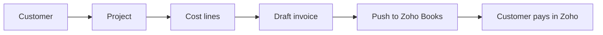

# Field CRM

Property & project management for field crews, with a manager dashboard and a Zoho Books path for invoicing.

## What you get

**Field ops (existing)**
- Worker daily reports (tasks, photos, delays, end-of-day check)
- Manager morning brief, full log, assigned tasks, live tasks calendar
- Sites & people admin, manager schedule, backup/restore

**CRM (new)**
- **Customers** — contacts, company, ABN, billing address, Zoho contact id
- **Projects** — linked to customers/sites, status pipeline, budget
- **Cost lines** — labour / materials / plant / subcontractor
- **Draft invoices** — built from project costs (AUD + 10% GST)

**Zoho (ready to wire)**
- Manager **Zoho** tab: connect status, draft queue, sync log
- Client API in `src/lib/zoho.js` (connect, push invoice/customer, pull stub)
- Edge function stub in `supabase/functions/zoho-oauth` (OAuth + Books create invoice)
- Tokens stay server-side; the browser only sees connection status

## Quick start

```bash
npm install
cp .env.example .env
# set VITE_SUPABASE_URL and VITE_SUPABASE_ANON_KEY
npm run dev
```

Apply the database:

1. Open your Supabase SQL editor
2. Run `supabase/schema.sql`
3. Ensure the `work-photos` storage bucket exists

## Zoho setup (when you are ready to invoice)

1. Create a Zoho API client (Books scopes) for your region (AU recommended).
2. Deploy the edge function:

```bash
supabase functions deploy zoho-oauth
supabase secrets set \
  ZOHO_CLIENT_ID=... \
  ZOHO_CLIENT_SECRET=... \
  ZOHO_REDIRECT_URI=https://YOUR_PROJECT.supabase.co/functions/v1/zoho-oauth?action=callback
```

3. In the app: Manager → **Zoho** → Connect Zoho Books.
4. On a project: add cost lines → **Draft invoice from costs** → **Push to Zoho**.

Until the edge function is deployed, pushes are **queued** in `zoho_sync_log` so nothing is lost.

## Layout

```
src/
  App.jsx                          # field reports + manager shell
  lib/crm.js                       # customers, projects, costs, invoices
  lib/zoho.js                      # Zoho client bridge
  components/crm/CrmTabContent.jsx # Customers / Projects / Zoho UI
supabase/
  schema.sql                       # core + CRM + Zoho tables & RLS
  functions/zoho-oauth/index.ts    # OAuth + Books API
```

## Typical billing flow



## Roles

| Role | Sees |
|------|------|
| Staff / contractor | Own form, own tasks, account |
| Manager | Morning brief, tasks, CRM, Zoho, admin, settings |
